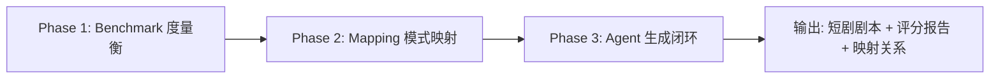
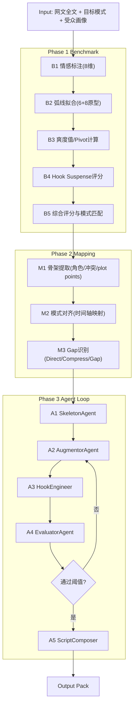

# AI评书艺人原型设计：UI + Pipeline

> 基于 `LITERATURE_SURVEY.md` 与 `NARRATIVE.md` 的产品化原型方案

## 1. 目标与范围

### 1.1 产品目标

把“网文 → 高留存短剧剧本”的改编过程做成可视化、可评估、可迭代的系统，核心能力：

1. 量化评估：Shuang Benchmark（情感弧线、爽度值、Hook、模式匹配、预测留存）
2. 模式化改编：将网文骨架映射到改编模板（复仇阶梯/身份剥洋葱等）
3. Agent协作生成：Skeleton / Augmentor / Hook / Evaluator 闭环优化

### 1.2 原型范围（MVP）

包含两部分：

1. `Prototype UI`（前端可展示）
2. `Adaptation Pipeline`（后端流程设计 + 数据契约）

不包含：

1. 真实视频处理与训练框架
2. 全量自动改写引擎生产化

---

## 2. 原型UI设计

## 2.1 信息架构（IA）

```text
AI评书艺人工作台
├── A. 项目总览（Project Workspace）
├── B. Pattern Studio（模式选择与参数）
├── C. Story Mapping（骨架映射与空白识别）
├── D. Episode Planner（分集节奏与Hook编排）
├── E. Benchmark Report（量化评分与风险）
└── F. Iteration Log（反馈循环与版本对比）
```

## 2.2 页面级原型

### A. 项目总览（Project Workspace）

**目标**：一屏回答“项目现在到哪了、质量如何、是否可进入生成/发布”。

模块：

1. 顶部 KPI 条
- `Shuang Score`（0-100）
- `Hook Health`（0-100）
- `预测留存区间`（如 34%-46%）
- `模式匹配度`（与目标模板偏差）

2. 进度看板
- Phase 1 Benchmark / Phase 2 Mapping / Phase 3 Generation 当前状态
- SSE 实时事件流（stage_start / stage_done / feedback_round）

3. 风险卡片
- 角色一致性风险
- 反转密度过低
- 付费卡点前爽度不足

### B. Pattern Studio

**目标**：选择改编模式并可视化其节奏目标。

模块：

1. 模式库卡片
- 复仇阶梯
- 身份剥洋葱
- 虐恋过山车
- 升级打怪
- 悬疑递进

2. 模式参数编辑器
- 集数范围（50-100）
- 反转频率（每 N 集）
- 付费卡点（第 8-12 集默认）
- 爽度分布曲线（均匀/递增/振荡/脉冲/阶梯）

3. 受众画像配置
- 年龄层、偏好题材、地区风格偏好

### C. Story Mapping

**目标**：把“网文原情节”映射到“短剧模板时间轴”。

模块：

1. 双栏映射视图
- 左侧：原网文骨架（plot points）
- 右侧：目标短剧节奏槽位（episode slots）

2. 空白识别图层
- `Direct`（可直接复用）
- `Compress`（需压缩）
- `Gap`（需增补）

3. 世界观约束区
- 角色设定边界
- 因果硬约束
- 禁止改写项

### D. Episode Planner

**目标**：进行分集编排，显式标注“原著/增补/重排”。

模块：

1. 分集时间轴
- 每集 1-2 分钟，显示：蓄压段、trigger、释放段、集尾 hook

2. 场景编辑面板
- 场景来源标签：`ORIGIN` / `AUGMENTED` / `REORDERED`
- 目标情感向量（8维）
- 反转类型（身份/权力/关系/信息）

3. Hook 工程面板
- Hook 类型（suspense/reveal/threat/reversal/choice/emotional）
- Suspense 目标值
- 下集承接点

### E. Benchmark Report

**目标**：把“是否爆款潜力”转成可解释指标。

模块：

1. 多图联动
- 情感弧线图（逐集）
- 爽度值时序（pivot spikes）
- Hook 强度热力图

2. 指标分解
- `Volume`（振幅）
- `Pivot`（单次转折强度）
- `Suspense`（结尾悬念）
- `Plot Twist`（预测偏离）

3. 建议区
- “第11-14集释放不足，建议补一次身份揭露”
- “第8集付费卡点前 suspense 未达阈值”

### F. Iteration Log

**目标**：可追踪可回滚。

模块：

1. 版本树
- v0 原始映射
- v1 增补后
- v2 Hook强化后

2. 差异审阅
- 每轮被改动的集数与场景
- 指标提升/下降归因

3. 通过门槛
- 达到阈值自动标记 `READY_FOR_SCRIPT_GEN`

---

## 3. Pipeline设计（端到端）

## 3.1 Phase结构



## 3.2 详细DAG



## 3.3 Stage输入输出契约

| Stage | 输入 | 输出 |
|---|---|---|
| B1 Emotion Tagging | 网文段落/台词 | `emotion_timeline.json` |
| B2 Arc Fitting | emotion_timeline | `arc_profile.json` |
| B3 Shuang Scoring | arc_profile + trigger候选 | `shuang_timeline.json` |
| B4 Hook Scoring | 分集结尾 | `hook_scores.json` |
| B5 Benchmark Fusion | B1-B4 | `benchmark_report.json` |
| M1 Skeleton Extract | 网文全文 | `skeleton.json` |
| M2 Pattern Mapping | skeleton + pattern_template | `mapping.json` |
| M3 Gap Detect | mapping | `gaps.json` |
| A2 Augment | gaps + world_rules | `augmented_outline.json` |
| A3 Hook Engineer | augmented_outline | `hooked_outline.json` |
| A4 Evaluate | hooked_outline + benchmark rules | `evaluation.json`, `feedback.json` |
| A5 Compose | 最终大纲 | `episodes/*.md`, `mapping_trace.json` |

## 3.4 质量门槛（建议）

1. `shuang_score >= 75`
2. `hook_health >= 70`
3. `模式匹配偏差 <= 0.2`
4. `角色一致性 >= 0.85`
5. `第8-12集至少1个高强度付费卡点`

---

## 4. 与现有系统融合建议

现有系统为“短剧翻译前分析”Dashboard，可增量融合：

1. 新增项目类型 `adaptation_project`
2. 复用现有：
- SSE 事件机制
- 项目/批次/集 监控框架
- Emotion/Hook 可视化组件能力

3. 新增能力：
- Pattern Studio 页面
- Story Mapping 编辑器
- Agent feedback 循环状态机

---

## 5. 原型接口草案（MVP）

### 5.1 REST

1. `POST /api/adaptation/projects`
2. `POST /api/adaptation/projects/{id}/run-benchmark`
3. `POST /api/adaptation/projects/{id}/run-mapping`
4. `POST /api/adaptation/projects/{id}/run-generation`
5. `POST /api/adaptation/projects/{id}/iterate`
6. `GET /api/adaptation/projects/{id}/report`
7. `GET /api/adaptation/projects/{id}/episodes/{ep}/outline`

### 5.2 SSE事件

1. `stage_update`
2. `stage_progress`
3. `feedback_round`
4. `version_created`
5. `quality_gate_passed`

---

## 6. 原型交互流程（用户视角）

1. 创建项目：上传网文 + 选择模式 + 受众画像
2. 运行 Benchmark：看基线弧线与爽度分布
3. 进入 Mapping：确认直映/压缩/增补分配
4. 启动 Agent Loop：自动增补 + Hook 工程 + 评估反馈
5. 审阅版本对比：选择最优版本导出剧本包

---

## 7. 交付清单（本轮设计）

1. UI 信息架构与核心页面原型
2. Phase1-3 全链路 Pipeline DAG
3. Stage 级数据输入输出契约
4. 质量门槛与迭代闭环
5. 与现有翻译系统的增量融合路径
